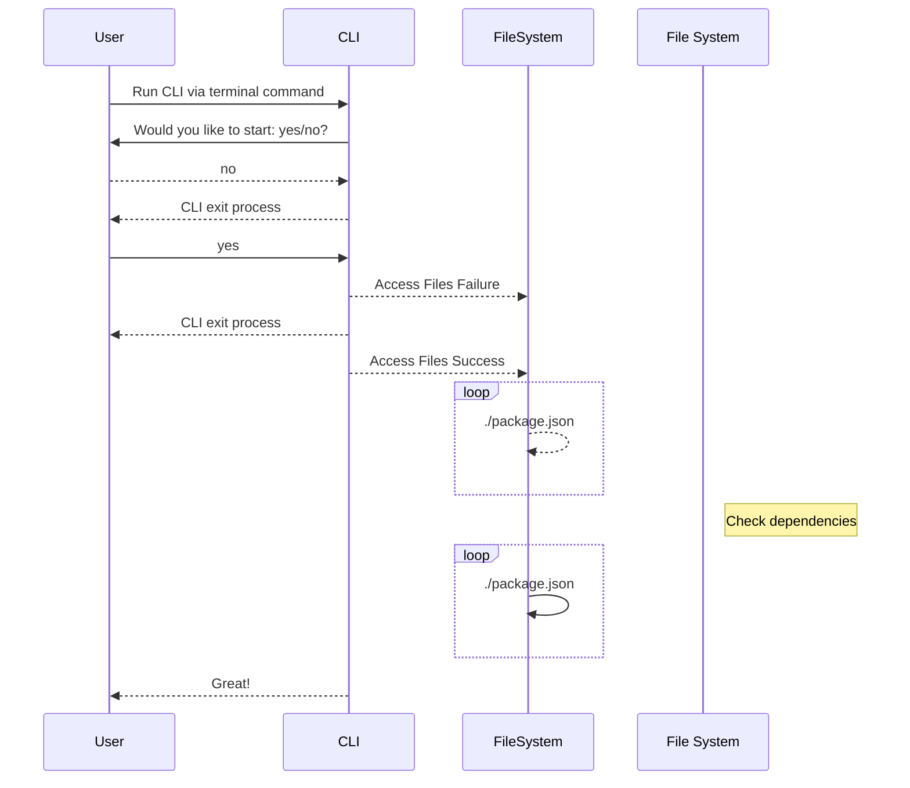

# JSDoc with better-docs template

Install
````bash
npm install --save-dev better-docs
````

Command line
````bash
jsdoc your-documented-file.js -t ./node_modules/better-docs
````

- [mermaid documentation](https://mermaid-js.github.io/mermaid/getting-started/theming.html)


